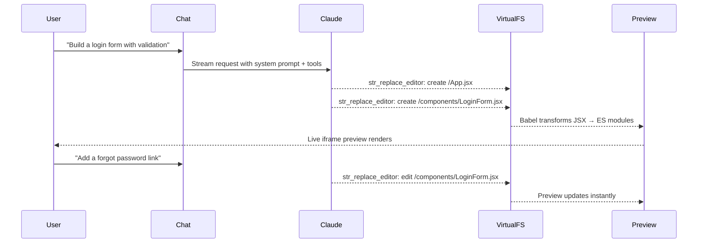
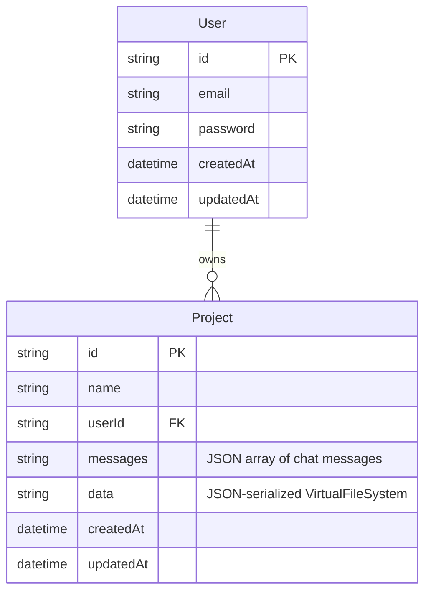

# UIGen

**AI-powered React component generator with live preview.**

Describe a UI component in plain English, and UIGen uses Claude AI to generate production-ready React code — rendered live in a sandboxed preview as you iterate.

---

## How It Works



---

## App Layout

```
┌─────────────────────────────────────────────────────────┐
│                        UIGen                            │
├──────────────────────┬──────────────────────────────────┤
│                      │  [ Preview ]  [ Code ]           │
│   Chat Interface     ├──────────────────────────────────┤
│                      │                                  │
│  > Describe your     │   ┌─── Live Preview ───────┐    │
│    component here    │   │                         │    │
│                      │   │   <iframe sandbox />    │    │
│  ┌────────────────┐  │   │                         │    │
│  │ Message input  │  │   └─────────────────────────┘    │
│  └────────────────┘  │                                  │
└──────────────────────┴──────────────────────────────────┘
```

---

## Architecture

```mermaid
graph TD
    A[Next.js App Router] --> B[/api/chat route]
    A --> C[Server Actions]

    B --> D[Vercel AI SDK streamText]
    D --> E[Claude API]
    D --> F[Mock Provider]

    E -->|tool calls| G[str_replace_editor]
    E -->|tool calls| H[file_manager]
    F -->|static output| G

    G --> I[VirtualFileSystem]
    H --> I

    I --> J[FileSystemContext]
    J --> K[PreviewFrame]
    K --> L[Babel JSX Transform]
    L --> M[Import Map + Blob URLs]
    M --> N[sandboxed iframe]

    C --> O[Prisma / SQLite]
    O --> P[User]
    O --> Q[Project\nmessages: JSON\ndata: VirtualFS JSON]
```

---

## Features

- **AI component generation** — Claude writes and edits your React files via tool calls
- **Live preview** — JSX is Babel-transformed in-browser and rendered in a sandboxed iframe
- **Virtual file system** — no files written to disk; the full FS is serialized to JSON for persistence
- **Code editor** — Monaco editor with full syntax highlighting
- **Iterative editing** — continue the conversation to refine, extend, or fix components
- **Auth + persistence** — sign up to save and reload projects; anonymous work is preserved on sign-in
- **Works without an API key** — mock provider returns static components for local development

---

## Setup

### Prerequisites

- Node.js 18+
- npm

### Install & Initialize

```bash
npm run setup
```

This installs dependencies, generates the Prisma client, and runs database migrations.

### Optional: Add Anthropic API Key

Create a `.env` file in the project root:

```
ANTHROPIC_API_KEY=your-api-key-here
```

Without a key, UIGen runs in mock mode — returning static Counter, Form, or Card components. All UI features work normally.

### Run

```bash
npm run dev
```

Open [http://localhost:3000](http://localhost:3000)

---

## Data Model



---

## Tech Stack

| Layer | Technology |
|---|---|
| Framework | Next.js 15 (App Router) |
| UI | React 19, Tailwind CSS v4, Radix UI |
| AI | Anthropic Claude, Vercel AI SDK |
| Code editor | Monaco Editor |
| JSX transform | Babel standalone |
| ORM | Prisma 6 |
| Database | SQLite |
| Auth | JWT (jose), bcrypt |
| Testing | Vitest, Testing Library |

---

## Development

```bash
npm test          # Run tests
npm run lint      # Lint
npx prisma studio # Browse database
npm run db:reset  # Reset database
```
